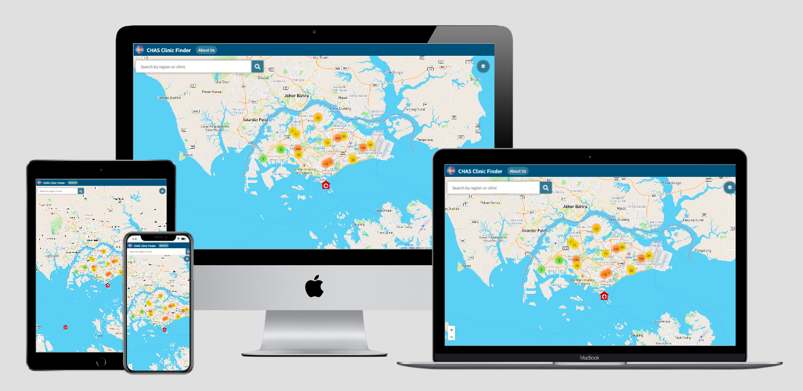

# CHAS Clinic Finder
 

Access the live demo of the website [here](https://zealous-haibt-e1010f.netlify.app)

## Project Summary

**Project Context**

The _CHAS Clinic Finder_ is a mobile-responsive and interactive map developed to allow its users to easily search for CHAS clinics around Singapore. CHAS refers to Community Health Assist Scheme (CHAS). Under this scheme, eligible citizens would be able to receive subsidized healthcare treatments in the participating clinic outlets.

**Organisational Goals**

The app aims to provide a service to ease the process of users in their search for CHAS clinics.

**User Goals**

The aim of users is to obtain subsidized healthcare services. The app thus seeks to help users achieve their needs by providing a quick and user-friendly map to locate nearby CHAS clinic.

**Justification for the App**

While there are location information of CHAS clinic online, the format in which the information are currently presented is not user-friendly (e.g. spreadsheet). Such hurdles could create unnecessary frustration especially for users that are seeking for medical attention urgently. As such, having an interactive map that allow users to see all the locations of CHAS clinics at a glance as well as having a built-in search bar could ease the search process.

## Project Complexity

Access the Project Complexity Matrix [here](https://github.com/kshannn/clinics-near-me/blob/e28a549dc7c0a7d06b959cba2dd1d22b4b90bd61/scoring/project_complexity.pdf)

## UX/UI

### **Strategy**
_Organisation_
* Objective: Provide a service to ease the process of users in their search for CHAS clinics

_User_
* Objective: To receive medical attention and/or healthcare service
* Needs: Quick way to locate nearby CHAS clinic 
* Demographics:
    * Individuals in their middle adulthood
    * From lower-income family
    * Sufficient literacy in using technological devices
* Pain point: Have to seek medical attention but information online cannot be easily accessed
* User stories example:
    1. As a person who is sick, I want to be able to access nearby CHAS clinics quickly so that I can seek immediate treatment.
        * Acceptance criteria: Location tracking function
    2. As a person who is stuck in a long queue at a CHAS clinic, I want to see if there are other clinics and pharmacies nearby so that I can consider seeking alternative treatment
        * Acceptance criteria: Feature that can allow users to see nearby clinics and pharmacies
    3. As a CHAS card holder, I want to clarify regarding the subsidies I am eligible for so that I can decide whether to visit the clinic.
        * Acceptance criteria(s): A call feature to the clinic, information regarding the different subsidy levels on the website

### **Scope**

_Functional Specifications_
* Search for clinics
* Turn on location service to detect nearby clinics
* Make call to clinics

_Content requirements_
* Information about the application
* Information about CHAS
* Details of clinic and pharmacies

_Non-functional requirements_
* Mobile responsiveness
    * Achieved via the use of appropriate media queries and flex box
* Performance

### **Structure**

* The CHAS Clinic Finder application is structured using a tree hierarchy.
* The navigation bar includes "About Us" to provide more details about the application
* The application uses language that is easy for users to understand and contains no technical jargons

### **Skeleton**

Access the wireframes for mobile, tablet, and laptop display for the website [here](https://github.com/kshannn/clinics-near-me/blob/a23464666e5f3c939614abe3e776bc484ec67397/wireframes/clinic_finder_mockup.pdf)

### **Surface**

_Colours_

 

* The main colour scheme of the app are the different shades of blue as depicted above. 
As the colour blue is often associated with trust and stability, a blue colour scheme was chosen to associate feelings of trust towards the app. In times of emergency (e.g. urgent medical attention is required), it is important that users trust that the app would function properly in helping them search for clinics.
* White font is generally used to contrast with the darker color scheme. This is to make it easier to read for users, where majority are presumed to be in their middle adulthood.

_Font Choice_
* The font used for the brand name is in san-serif to match the brand logo
* Font size is set to be big to allow users to see better.
* The use of san-serif makes words easier to read, which can be important for older users.

_Icons in place of markers_
* Instead of using the marker designs provided by Leaflet, the markers are replaced with icons that matches the marker (e.g. pharmacy markers are represented with a pill icon).This makes it easier to make the association using customized icons.
* Colors used for the icons are also selected to match the brand logo for consistency.

## **Features**

[Test Cases](https://github.com/kshannn/clinics-near-me/blob/32189b39c441dcd88911985900f8c38e9e7f213d/scoring/test_cases.pdf)

_Limitations and future implementations_
* Due to leaflet clustering feature, when map is set to view a coordinate, the exact location at the coordinate is not shown but instead a cluster number is shown. Using a higher zoom setting only resolves the problem sometimes.
* Currently, it takes some time to load the location tracking. In the future, I would like to improve the load time for location tracking or add a loading icon to indicate that location tracking is being loaded in the background.
* Include waiting time and vacancies at each clinic. To my knowledge, there is currently no API that provides these details .
* Some names of clinics/pharmarcies are the same as there are chain outlets. This causes repetition of search suggestions. In the future, I would like to differentiate this outlets by including their location details in the search suggestions as well.

**Testing for Mobile Responsiveness**
 * Testing was done using chrome developer tool across iPhone X, Galaxy S5, iPad, iPad Pro, 13-inch MacBook Air

## **Technologies Used**

* HTML5
    * To create the framework of the web app
* CSS3
    * To style various elements throughout the web app
* JavaScript
    * To include interactive elements throughout the web app
* [Bootstrap v4.6](https://getbootstrap.com/docs/4.6/getting-started/introduction/)
    * To create toggle buttons and alert popup
* [JQuery](https://getbootstrap.com/docs/4.6/getting-started/introduction/)
    * To apply bootstrap properties to dynamic innerHTML
* [Leaflet](https://leafletjs.com/)
    * To create the map of Singapore
    * To add in markers
    * To create layers and clusters for markers
    * To add current location tracking function
* [Font Awesome](https://fontawesome.com/)
    * For icons in the description box
* [Flaticon](https://www.flaticon.com/)
    * For customizing marker icons
* [Adobe Color](https://color.adobe.com/create/color-wheel)
    * To create a colour theme for the app
* [Git](https://git-scm.com/)
    * For version control
* [GitHub](http://github.com)
    * To store source code
* [Visual Studio Code](https://code.visualstudio.com/)
    * To edit source code
    * To view changes made to source code live
* [Balsamiq Mockups 3](https://balsamiq.com/)
    * To create wireframes
* [Netlify](https://www.netlify.com/)
    * To deploy web app
* [Google Font](https://fonts.google.com/)
    * To select font families used for web app (i.e. Noto Sans)
* [Multi Device Website Mockup Generator](https://techsini.com/multi-mockup/index.php)
    * To display screen-responsiveness of website across different devices

## **Deployment**

The web app is hosted using Netlify.

**Steps to deployment using Netlify**
1. Any edits were added, commited, and pushed to GitHub via the terminal on Visual Studio Code.
2. Go to https://www.netlify.com/ and log in with Github account. 
3. Click on "New site from Git" button
4. Select "GitHub" for continuous deployment
5. Authorize access to GitHub should a pop-up appear 
6. Select the repository that you want to deploy
7. Click on "Deploy site" button to get a link for the deployed site

**Dependencies**

* [Data.gov.sg](https://data.gov.sg/)
    * To obtain GeoJSON files for CHAS clinic locations and pharmacy locations
* [Axios](https://cdnjs.com/libraries/axios)
    * To call API

## **Credits**

* Code for debounce function
    * Taken and edited from techsith's YouTube video - ["Debounce in Javascript"](https://youtu.be/B1P3GFa7jVc)

* Leaflet markers' icons
    * Downloaded and edited from [Flaticon](https://www.flaticon.com/)

* Brand logo
    * Taken and edited from [CHAS website](https://www.chas.sg/default.aspx?type=public)

* Details about Community Health Assist Scheme (CHAS)
    * Extracted from [CHAS website](https://www.chas.sg/content.aspx?id=303)
* Deployment steps
    * Extracted and edited based on [TGC's deployment guide](https://docs.google.com/document/d/1f_aYsk4qqjYjkrWMOK5E2wS6hlasZL-ov7Q05ccSv9c/edit?usp=sharing)
* Design inspired by [Google Maps](https://www.google.com.sg/maps/)

