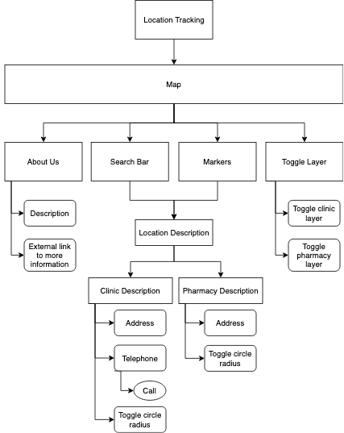

# CHAS Clinic Finder
 

Access the live demo of the website [here](https://zealous-haibt-e1010f.netlify.app).

## Project Summary

**Project Context**

The _CHAS Clinic Finder_ is a mobile-responsive and interactive map developed to allow its users to easily search for CHAS clinics around Singapore. CHAS refers to the Community Health Assist Scheme (CHAS). Under this scheme, eligible citizens will be able to receive subsidized healthcare treatments in the participating clinic outlets.

**Organisational Goals**

The app aims to provide a service to ease the process of users in their search for CHAS clinics through the use of current location tracking and responsive search features.

**User Goals**

The aim of users is to obtain subsidized healthcare services. The app thus seeks to help users achieve their needs by providing a quick and user-friendly map to locate nearby CHAS clinic.

**Justification for the App**

While there are location information of CHAS clinic online, the format in which the information are currently presented is not user-friendly (e.g. spreadsheet). Such hurdles could create unnecessary frustration especially for users that are seeking for medical attention urgently. As such, having an interactive map that allow users to see all the locations of CHAS clinics at a glance as well as having a built-in search bar could ease the search process.

## Project Complexity

Access the Project Complexity Matrix [here](https://github.com/kshannn/clinics-near-me/blob/e28a549dc7c0a7d06b959cba2dd1d22b4b90bd61/scoring/project_complexity.pdf).

## UX/UI

### **Strategy**
_Organisation_
* Objective: Provide a service to ease the process of users in their search for CHAS clinics

_User_
* Objective: To receive medical attention and/or healthcare service

* Needs: Quick way to locate nearby CHAS clinic 

* Demographics:
    * Individuals in their middle adulthood (more prone to health issues)
    * From lower-income family (heavily subsidised under CHAS)
    * Sufficient literacy in using technological devices

* Pain point: Have to seek medical attention but information online cannot be easily accessed

  
User Stories | Acceptance Criteria(s)
------------ | -------------
As a person who is sick, I want to be able to access nearby CHAS clinics quickly so that I can seek immediate treatment. | Location tracking function
As a person who is stuck in a long queue at a CHAS clinic, I want to see if there are other clinics and pharmacies nearby so that I can consider seeking alternative treatment. | Feature that can allow users to see nearby clinics and pharmacies
As a CHAS card user, I want to clarify regarding the subsidies I am eligible for so that I can decide whether to visit the clinic.| A call feature to the clinic and information regarding the different subsidy levels on the website

### **Scope**

_Functional Specifications_
* Search for clinics

* Turn on location service to detect nearby clinics

* Make call to clinics

_Content requirements_
* Information about the app

* Information about CHAS

* Details of clinic and pharmacies

_Non-functional requirements_
* Mobile responsiveness
    * Achieved via the use of appropriate media queries and flex box
* Performance

### **Structure**

 

* The CHAS Clinic Finder application is structured using a tree hierarchy. 
* When user loads the website, they will see a popup asking if they would like to turn on their location service for the map to track their current location. Choosing to turn on their location service would set the map to their current location while choosing not to do so would direct the user to the map that shows an overview of Singapore.

* The navigation bar includes "About Us" to provide more details about the application including an external link to more information about the CHAS subsidy details. 

* When a user enters a search term (e.g. bedok) into the search bar, the search suggestions will be narrowed down to only displaying those that contains "bedok" as the substring. Upon clicking one of the search suggestion, the map will zoom to the location of the clicked search suggestion and display a description box containing the location details. Clicking on any marker on the map also result in the same outcome. Users can click on the call button beside the telephone number to make a call. Users can also click on the toggle button in the description box to toggle a 500m circle radius around the active coordinates.

* Users can toggle the clinic layer and the pharmacy layer on and off when they click to expand the toggle button on the top right corner of the map site.

* The app uses language that is easy for users to understand and contains no technical jargons

### **Skeleton**

Access the wireframes for mobile, tablet, and laptop display for the website [here](https://github.com/kshannn/clinics-near-me/blob/7f6946e5c7c984a972f44dd81a9fd51f1859b544/wireframes/clinic_finder_mockup.pdf)

### **Surface**

_Colours_

 

* The main colour scheme of the app are the different shades of blue as depicted above. 
As the colour blue is often associated with trust and stability, a blue colour scheme was chosen to associate feelings of trust towards the app. In times of emergency (e.g. urgent medical attention is required), it is important that users trust that the app would function properly in helping them search for clinics.

* White font is generally used to contrast with the darker color scheme. This is to make it easier to read for users, where majority are presumed to be in their middle adulthood.

_Font Choice_
* The font used for the brand name is in san-serif to match the brand logo.

* Font size is set to be big to allow users to see better.

* The use of san-serif makes words easier to read, which can be important for users who are older and are more likely to have poorer eye sight.

_Icons in place of markers_
* Instead of using the marker designs provided by Leaflet, the markers are replaced with icons that are closely associated to them (e.g. pharmacy markers are represented with a pill icon).This makes it easier to draw the connection when using customized icons.

* Colors used for the icons (i.e. red, orange, yellow) were selected to match the brand logo for consistency.

## Features
1. **Users can allow the map to access their current location**. This provide users with an idea of the available CHAS clinics and pharmacies that are close to them. Users would be asked if they would allow the app access to their current location. Upon agreeing, the app would track their current location and immediatelly show where they are on the Leaflet map. 

2. **Search suggestions would appear as users type.** This feature makes the search process more efficient and intuitive as users can search without having to type out the full search query. This feature is created using an event listener that updates search suggestion at every key press. The feature is also paired together with the debounce function so that the function waits before firing instead of updating the suggestions at every key press.

3. **Users can toggle on/off a 500m radius circle around a location.** This circle allows users to estimate how far they are from other clinics or pharmacies. This can be useful for those who want to be able to easily see which clinics are closest to them, for those who want to find a nearby pharmacy to get additional healthcare supplies, or for those who want to try out other clinic outlets should there be a long queue for the one they are currently at. This feature is implemented by creating Leaflet circle layers.

4. **Clicking on a search suggestion or a marker displays the description of the clinic/pharmacy.** Useful information such as the address and telephone number of the clinics/pharmacies would be displayed for users' reference. This feature is implemented by attaching click event listeners to the search suggestion and markers, as well as showing and hiding the description box using CSS class properties.

5. **Users can directly call the clinic by clicking on the call button next to the clinic hotline.** In the event that users need to contact medical staff from a particular CHAS clinic, they can do so easily by clicking or tapping on the call button. By tapping on the call button, they will be redirected to the call feature depending on the device they are using.

6. **Users would receive an alert prompt if they key in an invalid input.** When users search with an empty field or search with an input that does not exist, they would be prompted by an alert message to enter a valid input. The alert message can be dismissed using the close button or when the user re-enters a valid search term. This feature is implemented using the bootstrap alert class.

7. **Users can toggle the clinic and pharmacy layers.** This allow users to show and hide the layers they prefer to see. For example, users may want to view just the CHAS clinic on the map and thus choose to hide all the pharmacies. On the top right corner of the screen, there is a button that allow users to toggle the clinic and pharmacy layers on and off depending on which markers they would like to view. This feature is implemented using leaflet layer group feature.

8. **Markers within close proximty are clustered together.** With a clutter-free map, users would be able to view the location of each clinic and pharmacy more easily. This feature is implemented with leaflet clustering feature.

_Limitations and future implementations_
* Due to leaflet clustering feature, when map is set to view a coordinate, the exact location at the coordinate is not shown but instead a cluster number is shown. Using a higher zoom setting only resolves the problem sometimes.

* Currently, it takes some time to load the location tracking. In the future, I would like to improve the load time for location tracking or add a loading icon to indicate that location tracking is being loaded in the background.

* Include waiting time and vacancies at each clinic. To my knowledge, there is currently no API that provides these details .

* Some names of clinics/pharmarcies are the same as there are chain outlets. This causes repetition of search suggestions. In the future, I would like to differentiate this outlets by including their location details in the search suggestions as well.

* In the future, I would like to implement search using the ENTER key as well. Currently, I am unable to attach keyup event listener to ENTER key as it conflicts with other function.

## Testing

**Test Cases**

Access the test cases [here](https://github.com/kshannn/clinics-near-me/blob/de025924b7e888bd24ed85362eb7b295252b242f/scoring/test_cases.pdf).

**Testing for Mobile Responsiveness**
 * Testing was done using chrome developer tool across iPhone X, Galaxy S5, iPad, iPad Pro, 13-inch MacBook Air

## Technologies Used

* HTML5
    * To create the framework of the web app
* CSS3
    * To style various elements throughout the web app
* JavaScript
    * To include interactive elements throughout the web app
* [Bootstrap v4.6](https://getbootstrap.com/docs/4.6/getting-started/introduction/)
    * To create toggle buttons and alert popup
* [JQuery](https://getbootstrap.com/docs/4.6/getting-started/introduction/)
    * To apply bootstrap properties to dynamic innerHTML
* [Leaflet](https://leafletjs.com/)
    * To create the map of Singapore
    * To add in markers
    * To create layers and clusters for markers
    * To add current location tracking function
* [Font Awesome](https://fontawesome.com/)
    * For icons in the description box
* [Flaticon](https://www.flaticon.com/)
    * For customizing marker icons
* [Adobe Color](https://color.adobe.com/create/color-wheel)
    * To create a colour theme for the app
* [Git](https://git-scm.com/)
    * For version control
* [GitHub](http://github.com)
    * To create repository
* [Visual Studio Code](https://code.visualstudio.com/)
    * To edit code
    * To view changes made to code live
* [Balsamiq Mockups 3](https://balsamiq.com/)
    * To create wireframes
* [Netlify](https://www.netlify.com/)
    * To deploy web app
* [Google Font](https://fonts.google.com/)
    * To select font families used for web app (i.e. Montserrat, Open Sans)
* [Multi Device Website Mockup Generator](https://techsini.com/multi-mockup/index.php)
    * To display screen-responsiveness of website across different devices

## Deployment

The web app is hosted using Netlify.

**Steps to deployment using Netlify**
1. Any edits were added, commited, and pushed to GitHub via the terminal on Visual Studio Code.
2. Go to https://www.netlify.com/ and log in with Github account. 
3. Click on "New site from Git" button
4. Select "GitHub" for continuous deployment
5. Authorize access to GitHub should a pop-up appear 
6. Select the repository that you want to deploy
7. Click on "Deploy site" button to get a link for the deployed site

**Dependencies**

* [Data.gov.sg](https://data.gov.sg/)
    * To obtain GeoJSON files for CHAS clinic locations and pharmacy locations
* [Axios](https://cdnjs.com/libraries/axios)
    * To call API

## Credits

* Code for debounce function
    * Taken and edited from techsith's YouTube video - ["Debounce in Javascript"](https://youtu.be/B1P3GFa7jVc)

* Leaflet markers' icons
    * Downloaded and edited from [Flaticon](https://www.flaticon.com/)

* Brand logo
    * Taken and edited from [CHAS website](https://www.chas.sg/default.aspx?type=public)

* Details about Community Health Assist Scheme (CHAS)
    * Extracted from [CHAS website](https://www.chas.sg/content.aspx?id=303)
* Deployment steps
    * Extracted and edited based on [TGC's deployment guide](https://docs.google.com/document/d/1f_aYsk4qqjYjkrWMOK5E2wS6hlasZL-ov7Q05ccSv9c/edit?usp=sharing)
* Design of map inspired by [Google Maps](https://www.google.com.sg/maps/)

